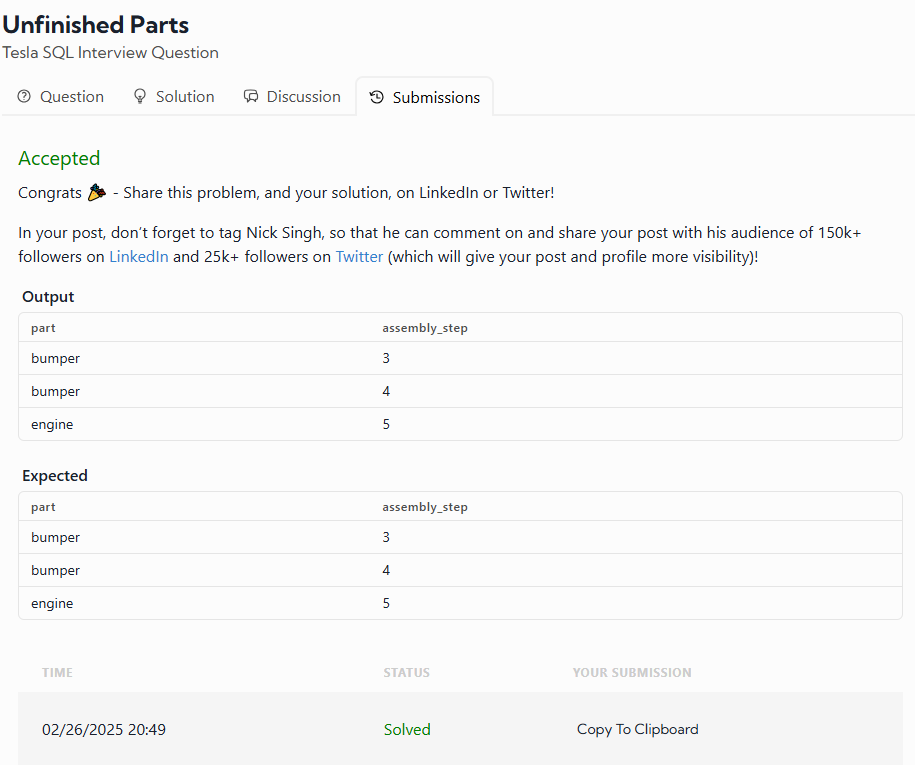

# Candidate Selection for Data Science Job

## Problem Statement
Given a table of candidates and their skills, you need to find the candidates best suited for an open Data Science job. The ideal candidates must be proficient in **Python, Tableau, and PostgreSQL**.

Write a query to list the candidates who possess all of the required skills for the job. The output should be sorted by `candidate_id` in **ascending order**.

## Assumption
- There are no duplicate records in the `candidates` table.

## Table Schema
### `candidates` Table:
| Column Name   | Type    |
|--------------|---------|
| candidate_id | integer |
| skill        | varchar |

## Example Input
### `candidates` Table:
| candidate_id | skill      |
|--------------|-----------|
| 123          | Python    |
| 123          | Tableau   |
| 123          | PostgreSQL|
| 234          | R         |
| 234          | PowerBI   |
| 234          | SQL Server|
| 345          | Python    |
| 345          | Tableau   |

## Example Output
| candidate_id |
|--------------|
| 123          |

## My solution was very simple

SELECT candidate_id from candidates where skill in('Python','Tableau','PostgreSQL') order by candidate_id LIMIT 1;

### Why I used this, based on the last days I saw the fuctions IN, LIMIT and ORDER BY. And the fuctions are very simple. I'm gonna explain this, 

### The fuction IN is used to get the text or number that are IN the parentheses.
### The fuction LIMIT is used to limite the number of rows in your result.
### The fuction ORDER BY is used to order a specific row in ascending.

# My result was:

---

# Tesla Production Bottleneck Analysis

## Problem Statement
Tesla is investigating production bottlenecks and needs your help to extract the relevant data. Write a query to determine which parts have begun the assembly process but are not yet finished.

## Assumptions
- The `parts_assembly` table contains all parts currently in production, each at varying stages of the assembly process.
- An **unfinished part** is one that lacks a `finish_date`.
- This question is straightforward, so let's approach it with simplicity in both thinking and solution.
- **Effective April 11th, 2023**, the problem statement and assumptions were updated to enhance clarity.

## Table Schema
### `parts_assembly` Table:
| Column Name    | Type     |
|---------------|----------|
| part         | string   |
| finish_date  | datetime |
| assembly_step | integer  |

## Example Input
### `parts_assembly` Table:
| part    | finish_date        | assembly_step |
|---------|-------------------|--------------|
| battery | 01/22/2022 00:00:00 | 1           |
| battery | 02/22/2022 00:00:00 | 2           |
| battery | 03/22/2022 00:00:00 | 3           |
| bumper  | 01/22/2022 00:00:00 | 1           |
| bumper  | 02/22/2022 00:00:00 | 2           |
| bumper  | NULL                | 3           |
| bumper  | NULL                | 4           |

## Example Output
| part   | assembly_step |
|--------|--------------|
| bumper | 3            |
| bumper | 4            |

## My solution was very simple

SELECT part,assembly_step FROM parts_assembly where finish_date IS NULL;;

### Why I used this, based on my experience the best solutcion is IS NULL.

### The fuction IS NULL is used to get all the rows that are NULLS.

# My Result was:

---

# Rating Table
| Title                         | Rating  | Rating Level |
|--------------------------------|---------|------------------------------------------------------------|
| Grey's Anatomy                | TV-14   | Parents strongly cautioned. May be unsuitable for children ages 14 and under. |
| Prison Break                  | TV-14   | Parents strongly cautioned. May be unsuitable for children ages 14 and under. |
| How I Met Your Mother         | TV-PG   | Parental guidance suggested. May not be suitable for all children. |
| Supernatural                   | TV-14   | Parents strongly cautioned. May be unsuitable for children ages 14 and under. |
| The Vampire Diaries            | TV-14   | Parents strongly cautioned. May be unsuitable for children ages 14 and under. |
| Pretty Little Liars            | TV-14   | Parents strongly cautioned. May be unsuitable for children ages 14 and under. |
| Once Upon a Time               | TV-PG   | Parental guidance suggested. May not be suitable for all children. |
| Sherlock                       | TV-14   | Parents strongly cautioned. May be unsuitable for children ages 14 and under. |
| Death Note                     | TV-14   | Parents strongly cautioned. May be unsuitable for children ages 14 and under. |
| Naruto                         | TV-PG   | Parental guidance suggested. May not be suitable for all children. |
| Arrow                          | TV-14   | Parents strongly cautioned. May be unsuitable for children ages 14 and under. |
| The Originals                  | TV-14   | Parents strongly cautioned. May be unsuitable for children ages 14 and under. |
| The Flash                      | TV-PG   | Parental guidance suggested. May not be suitable for all children. |
| The Seven Deadly Sins          | TV-14   | Parents strongly cautioned. May be unsuitable for children ages 14 and under. |
| Scream                         | TV-14   | Parents strongly cautioned. May be unsuitable for children ages 14 and under. |
| Stranger Things                | TV-14   | Parents strongly cautioned. May be unsuitable for children ages 14 and under. |
| The Office (U.S.)              | TV-14   | Parents strongly cautioned. May be unsuitable for children ages 14 and under. |
| 90210                          | TV-14   | Parents strongly cautioned. May be unsuitable for children ages 14 and under. |
| Gossip Girl                    | TV-14   | Parents strongly cautioned. May be unsuitable for children ages 14 and under. |
| Criminal Minds                 | TV-14   | Parents strongly cautioned. May be unsuitable for children ages 14 and under. |
| Friends                        | TV-14   | Parents strongly cautioned. May be unsuitable for children ages 14 and under. |
| Parks and Recreation           | TV-14   | Parents strongly cautioned. May be unsuitable for children ages 14 and under. |
| Schitt's Creek                 | TV-14   | Parents strongly cautioned. May be unsuitable for children ages 14 and under. |
| Life in Pieces                 | TV-14   | Parents strongly cautioned. May be unsuitable for children ages 14 and under. |
| The Great British Baking Show  | TV-PG   | Parental guidance suggested. May not be suitable for all children. |
| Jane The Virgin                | TV-14   | Parents strongly cautioned. May be unsuitable for children ages 14 and under. |
| Crazy Ex-Girlfriend            | TV-14   | Parents strongly cautioned. May be unsuitable for children ages 14 and under. |
| Greenleaf                      | TV-14   | Parents strongly cautioned. May be unsuitable for children ages 14 and under. |
| Nancy Drew                     | PG      | Parental guidance suggested. May not be suitable for children. |
| Gilmore Girls                  | TV-14   | Parents strongly cautioned. May be unsuitable for children ages 14 and under. |
| Parenthood                     | TV-14   | Parents strongly cautioned. May be unsuitable for children ages 14 and under. |
| Life Unexpected                | TV-PG   | Parental guidance suggested. May not be suitable for all children. |

## What are the top 100 TV shows on Netflix that have a rating level starting with "Parent"?

SELECT title,rating,ratinglevel FROM netflix where ratinglevel like "Parent%" limit 100;

# Battle Table 
| Battle Name                            | Year | Battle Number |
|-----------------------------------------|------|--------------|
| Battle of Moat Cailin 299              | 299  | 8            |
| Battle of Deepwood Motte 299           | 299  | 9            |
| Battle of the Stony Shore 299          | 299  | 10           |
| Battle of Torrhen's Square 299         | 299  | 11           |
| Battle of Winterfell 299               | 299  | 12           |
| Sack of Torrhen's Square 299           | 299  | 13           |
| Sack of Winterfell 299                 | 299  | 14           |
| Battle of Oxcross 299                  | 299  | 15           |
| Siege of Storm's End 299               | 299  | 16           |
| Battle of the Fords 299                | 299  | 17           |
| Sack of Harrenhal 299                  | 299  | 18           |
| Battle of the Crag 299                 | 299  | 19           |
| Battle of the Blackwater 299           | 299  | 20           |
| Siege of Darry 299                     | 299  | 21           |
| Battle of Duskendale 299               | 299  | 22           |
| Battle of the Burning Septry 299       | 299  | 23           |
| Battle of the Ruby Ford 299            | 299  | 24           |
| Retaking of Harrenhal 299              | 299  | 25           |
| The Red Wedding 299                    | 299  | 26           |
| Siege of Seagard 299                   | 299  | 27           |
| Battle of Castle Black 300             | 300  | 28           |
| Fall of Moat Cailin 300                | 300  | 29           |
| Sack of Saltpans 300                   | 300  | 30           |
| Retaking of Deepwood Motte 300         | 300  | 31           |
| Battle at the Mummer's Ford 298        | 298  | 2            |
| Battle of Riverrun 298                 | 298  | 3            |
| Battle of the Green Fork 298           | 298  | 4            |
| Battle of the Whispering Wood 298      | 298  | 5            |
| Battle of the Camps 298                | 298  | 6            |
| Sack of Darry 298                      | 298  | 7            |
| Battle of the Shield Islands 300       | 300  | 32           |
| Invasion of Ryamsport, Vinetown, and Starfish Harbor 300 | 300  | 33 |
| Second Siege of Storm's End 300        | 300  | 34           |
| Siege of Dragonstone 300               | 300  | 35           |
| Siege of Riverrun 300                  | 300  | 36           |
| Siege of Raventree 300                 | 300  | 37           |
| Siege of Winterfell 300                | 300  | 38           |
| Battle of the Golden Tooth 298         | 298  | 1            | 

## What are the battle names, years, and battle numbers of all battles from the got_battles table, where the battle name is formed by concatenating the battle name and the year?

Select CONCAT(name,' ', year),year,battle_number from got_battles

# Airbnb Listings
| ID       | Listing URL                            | Name                                    | Summary                                                                                         | City    | State | Price  | Room Type      | Accommodates | Bathrooms | Bedrooms | Beds | Host Name | Host Since | Host Location                     |
|----------|---------------------------------------|-----------------------------------------|-------------------------------------------------------------------------------------------------|---------|-------|--------|---------------|-------------|-----------|----------|------|-----------|------------|----------------------------------|
| 12147973 | [Link](https://www.airbnb.com/rooms/12147973) | Sunny Bungalow in the City             | Cozy, sunny, family home with a garden, hens, and beehives. Short walk to local restaurants.   | Boston  | MA    | $250.00 | Entire home/apt | 4           | 1.5       | 2        | 3    | Virginia  | 2015-04-15 | Boston, Massachusetts, United States |
| 3075044  | [Link](https://www.airbnb.com/rooms/3075044)  | Charming room in pet friendly apt      | Quiet room with a full-size bed in a 1910 condo. Shared bathroom.                              | Boston  | MA    | $65.00  | Private room   | 2           | 1.0       | 1        | 1    | Andrea    | 2012-06-07 | Boston, Massachusetts, United States |
| 12023024 | [Link](https://www.airbnb.com/rooms/12023024) | Cozy room in a well located house      | Private room in a family house near shops, restaurants, and public transportation.            | Boston  | MA    | $60.00  | Private room   | 2           | 1.0       | 1        | 1    | Ricardo   | 2016-03-24 | Boston, Massachusetts, United States |
| 1109224  | [Link](https://www.airbnb.com/rooms/1109224)  | 4 bedroom Victorian Condo unit         | Spacious four-bedroom apartment with fully equipped kitchen and free Wi-Fi.                   | Boston  | MA    | $429.00 | Entire home/apt | 8           | 2.0       | 4        | 6    | Lita      | 2011-12-23 | Boston, Massachusetts, United States |
| 4860853  | [Link](https://www.airbnb.com/rooms/4860853)  | Ideal studio in the Back Bay/S. End    | Fully-equipped studio with kitchenette and private bath in a historic neighborhood.           | Boston  | MA    | $225.00 | Entire home/apt | 2           | 1.0       | 0        | 1    | Brent     | 2011-07-13 | Boston, Massachusetts, United States |
| 5532549  | [Link](https://www.airbnb.com/rooms/5532549)  | South End close to Back Bay            | Modern apartment near restaurants and public transit. Safe area of the city.                  | Boston  | MA    | $250.00 | Entire home/apt | 6           | 1.0       | 2        | 3    | Kimberly  | 2015-01-19 | Boston, Massachusetts, United States |
| 8631257  | [Link](https://www.airbnb.com/rooms/8631257)  | Cozy private bedroom                   | One bedroom in a loft-style apartment. Convenient and historic area in Boston.               | Boston  | MA    | $50.00  | Private room   | 1           | 1.5       | 1        | 1    | Peng      | 2014-04-15 | Boston, Massachusetts, United States |
| 9663423  | [Link](https://www.airbnb.com/rooms/9663423)  | Cozy South End Apt in best location    | One-bedroom condo on a tree-lined street with outdoor space and grill.                        | Boston  | MA    | $115.00 | Entire home/apt | 3           | 1.0       | 1        | 1    | Christopher | 2014-10-14 | Boston, Massachusetts, United States |
| 6763409  | [Link](https://www.airbnb.com/rooms/6763409)  | Columbus Avenue By Maverick, Five      | Stylish studio centrally located with modern appliances and free Wi-Fi.                       | Boston  | MA    | $150.00 | Entire home/apt | 2           | 1.0       | 0        | 1    | Alicia    | 2014-10-09 | Middlesex County, Massachusetts, United States |

## What are the concatenated values of the host's name and neighborhood, along with the length of the host's name and the length of the concatenated value, for the first 10 listings in the boston_airbnb_listings table?

select CONCAT(host_name,' - ',host_neighbourhood),LENGTH(host_name),LENGTH(CONCAT(host_name,' - ',host_neighbourhood)) from boston_airbnb_listings limit 10;

## What are the concatenated values of the host's name and neighborhood, the length of the host's name, the length of the concatenated value, the first five characters of the host's name, and the last five characters of the host's name for the first 10 listings in the boston_airbnb_listings table?

select CONCAT(host_name,' - ',host_neighbourhood),LENGTH(host_name),LENGTH(CONCAT(host_name,' - ',host_neighbourhood)),LEFT(host_name,5),RIGHT(host_name,5) from boston_airbnb_listings limit 10
